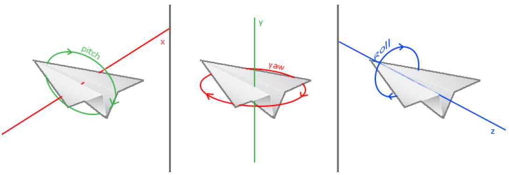

# README

## 实验环境

本实验的所有环节均是在**Windows 10**操作系统上，使用基于OpenGL 4.6核心库完成。实验编译使用了**TDM-GCC 10.3.0**编译器，除了编译器所自带的基本库之外，与OpenGL相关的所有库均已包含在本工程项目中，您可以直接在本工程目录下进行编译而无需再添加其他库。

## 编译与链接

在工程项目的主目录（即本Readme.md文档所在目录）中，包含了一个构建起整个工程的`Makefile`文件，通过在该目录下使用`make`命令能够进行自动编译，并在`bin`目录下生成可执行文件。如果使用了TDM-GCC等编译器或需要进行交叉编译，可通过修改`Makefile`中CROSS_COMPILE 选项，比如对TDM-GCC可能就需要将其改为mingw32-，随后再进行编译，即可生成对应需求的可执行文件。

在工程项目编译过程中生成了许多的编译文件，如果您想清理这些文件的话，可以使用`make clean`命令清理。

## 运行程序

本项目生成的可执行程序位于`bin`目录下。要运行该可执行文件，您可以直接在主目录中使用`make run`命令来运行它。

~~~shell
make run
~~~

正常情况下，执行`make run`之后您就可以看到OpenGL程序绘制出的太阳系景象了。当然，**您也可以通过打开`bin`目录并运行其中的`Nobel.exe`文件运行程序**。

您可以与该程序进行一定的交互，实现在太阳系中的漫游。相关交互功能如下：

|      操作      |           功能           |
| :------------: | :----------------------: |
|      `W`       |           前进           |
|      `S`       |           后退           |
|      `A`       |           左移           |
|      `D`       |           右移           |
|    `space`     |         投掷炸弹         |
|      `P`       |     切换鼠标聚焦模式     |
|      `R`       |  恢复默认设置与初始位置  |
| `mouse button` |  按住鼠标可拖动改变视角  |
| `mouse scroll` |  滑动鼠标滚轮可改变视野  |
|  `mouse move`  | 聚焦模式下焦点随鼠标移动 |
|     `ESC`      |         退出程序         |

## 目录结构

为了更好地帮助您理解该工程中的内容，这里将简要介绍工程中每一个目录所包含的东西。

在`bin`目录下，存放的是工程编译所生成的可执行文件，动态链接库的`dll`文件以及相关渲染所需资源；在`inc`目录下，包含了我所编写的用于程序执行的所有头文件；在`lib`目录下包含了本工程链接过程中需要用到的第三方库以及我所编写生成的函数库；在`res`目录下，包含了渲染图形过程中需要用到的渲染器与图片资源；在`src`目录下则包含了最为核心的代码，其中的`include`目录下放置的为使用第三方库的头文件。程序的`main`函数位于主目录下的`main.cpp`中，该函数定义了程序的入口。

# 设计文档

## 简介

《诺贝尔模拟器》是一款模拟真实世界的冒险游戏，玩家将以主人公的视角在虚拟世界中探索。玩家拥有向前方抛掷炸弹的能力，炸弹爆炸将会对物体和地面产生不同的效果。为了营造真实的氛围，我们不仅实现了碰撞检测，还添加了高级的光照模型，让玩家身临其境。

## 基本要求实现

### 体素建模

在游戏之中，我们通过建立立方体、球体等基本三维物体的顶点坐标、顶点法向量信息等，构建起了游戏之中的基本体素。

在实现上看，该基本体素的渲染可以分为以下几个部分：

- 在物体局部坐标系中绘制球体、立方体等基本三维图形
  通过几何变换将物体以合适的大小与角度置于世界坐标系中相应的位置
- 利用世界坐标系和观察坐标系的变换，得到观察坐标系中的物体表示
- 裁剪超出屏幕部分的空间
- 映射到屏幕坐标系中渲染图像

之所以将物体渲染的过程拆分到这么多个不同的坐标系中完成，是因为在每一个坐标系中，我们都能够以较为有意义且相对简单的方式对图像进行变换，而不必考虑多部图像变化组合之后的效果。通过一步步逐渐构建系统可以让我们的代码层次更有逻辑。

#### 球体

由于球体表明处处为曲面，要直接画出真正的球体对于计算机来说几乎是不可能的。但在一定程度的近似下，对于一个面数很多的正多面体却可以近似成为一个球体。我们可以通过球坐标的表示在球体上取点，将这些点所组成的面拼接在一起即可获得一个近似于球体的多面体。

在球坐标下，任意一点的坐标$(x, y, z)$都可以通过球坐标$(R, \theta, \phi)$的方式来表示。

如上图所示，球坐标转化为三维普通坐标系下的转化公式为：
$$
\begin{equation}
    \left\{
        \begin{array}{r}
            x = R \sin ( \phi ) cos(\theta) \\
            y = R \sin ( \phi ) sin(\theta) \\
            z = R \cos ( \phi )
        \end{array}
    \right.
\end{equation}
$$

根据该公式，我们在指定球体半径$R$的情况下，通过遍历球体的两个角度参数$\phi$和$\theta$，就可以求出均匀的球体上的点了。再将这些点通过画矩形的方式连接成多面体，我们就得到了一个近似多面体的球体。

不过，因为在我们OpenGL的世界中y轴才是指向天空向上的方向，所以，在上面的公式里我们还要将y轴和z轴调换一下。

#### 立方体

与复杂的球体绘制不同，立方体的绘制就十分简单了。在制作立方体时，我们只需要制定出六个面的各个参数即可。由于立方体一共只有8个点，画6个面也只需要写24个点的坐标对应情况，我们直接打表的方式全部列出即可获得。

### 三维网格导入

由于工程初期对于实验要求不明确以及工期紧张，我们的三维网格导入模块的实现使用了 assimp 库，具体实现见文件 Model.h 。我们实现的代码可以读取 obj文件及其纹理图片、材质信息。

### 漫游

虽然OpenGL本身没有摄像机(Camera)的概念，但我们可以通过把场景中的所有物体往相反方向移动的方式来模拟出摄像机，产生一种我们在移动的感觉，而不是场景在移动。通过世界坐标系和观察坐标系的变换就可以形成漫游的感觉。

#### 自由移动

为了表示摄像机所处的各种状态，我们可以创建一个摄像机类，并在其中记录下摄像机所处的位置向量$Position$、观察方向向量$Front$、指向摄像机右侧的向量$Right$以及指向摄像机上方的向量$Up$。并且，后三个向量满足相互垂直的关系。

由于在用户不断改变视角的过程中，摄像机的朝向也在不断发生变化。如果要时时刻刻追踪摄像机的$Right$向量和$Up$向量是十分困难的。为此，我们可以固定一个始终指向世界上方的向量$WorldUp$，
通过$Front$向量，$Right$向量和$Up$向量三者的关系得到如下计算公式：
$$
\begin{equation}
    \left\{
        \begin{array}{r}
            Right =& Front \times WorldUp \\
            Up =& Right \times Front
        \end{array}
    \right.
\end{equation}
$$
根据该公式，我们就可以计算得出每一刻摄像机的$Right$向量和$Up$向量了。
有了$Front$向量和$Right$向量之后，摄像机的自由移动便十分简单了。如果摄像机需要前后移动，我们只需要为摄像机的$Position$向量减去或者加上一定比例的$Front$向量；如果摄像机需要左右移动，那么就为摄像机的$Position$向量减去或者加上一定比例的$Right$向量。这样，我们就可以让我们的摄像机在场景中任意游走了。

#### 视角移动

不过，如果只能够前后左右移动的话，我们的视角依然十分受限。为了能够改变摄像机的视角，我们还需要引入摄像机的欧拉角参数。

其中，pitch代表的是摄像机的俯仰角，yaw代表的是摄像机的偏航角，而roll代表摄像机的滚转角。当然，为了简单起见，在我们的项目中不考虑滚转角的影响。通过三角公式的推导，我们可以得到俯仰角和偏航角影响下各个方向坐标的变换。

根据公式和三角函数关系，我们可以得到摄像机的观察方向与俯仰角和偏航角的关系：
$$
\begin{equation}
    \left\{
        \begin{array}{l}
            front.x = \cos(yaw) cos(pitch) \\
            front.y = R \sin(pitch) \\
            front.z = R \sin(yaw) cos(pitch)
        \end{array}
    \right.
\end{equation}
$$
利用该公式结合鼠标移动变换产生的俯仰角和偏航角的变化，我们就可以计算得到摄像机的观察方向的前向向量了。

#### 视角变换

当我们拥有了摄像机在世界坐标系中所处位置的信息$Position$向量以及摄像机自身所构成坐标系的单位向量在世界坐标系中的各个分量的情况，即$Front$， $Up$和$Right$向量时，我们就可以通过一个$4\times 4$的矩阵创建出从世界坐标系到概念坐标系的变换矩阵$LookAt$了。其中所创建的变换矩阵应具有如
下形式：

在玩家漫游过程中，我们通过对摄像机的$y$坐标进行限制，让玩家只能够在地面之上漫游，而避免了穿出地下的问题。

### 材质纹理

### 纹理坐标映射

在管线化编程的OpenGL之中，纹理材质的加载和光照一样也大多可以在shader中完成。采用纹理坐标映射的方法加载问题时，我们所要加载的纹理可以是一张已经预先通过其他方式生成好的二维图片。在OpenGL绑定物体时，我们可以同时将物体的顶点信息、法向量以及**每一个顶点所对应在纹理图片上的纹理坐标**输送给顶点着色器，让顶点着色器和片段着色器会根据图像的问题坐标将材质贴图映射到我们真实的物体之上，并根据材质信息渲染出相应的光照效果。

在光照射到物体表明时，光线会与物体表明的材质发生作用。根据物体表明材质的不同与各类光照效果的差异，最终物体的材质会在光照颜色和物体表面颜色的叠加作用下共同叠加显现。

### 天空盒

天空盒是环绕在渲染场景的周围，作为三维场景中的背景而存在。天空盒利用上下左右前后六个方位的贴图环绕，可以给用户以身临其境之感。加入天空盒之后，整个场景的效果看上去会好非常多，但实现起来却并不复杂。

在实现了纹理映射之后，我们已经可以对任何一个物体贴上想要的材质了。而天空盒可以视为是一个无限大的**立方体**，我们为这个立方体**贴上六个画面**，取消掉用户观察这个立方体时所带来的深度变化的影响而形成一种背景远在天边之感。用户置身于天空盒的立方体之中时，就会有在一种真实场景中漫游的感觉。

## 炸弹设计

真实世界中，当我们向外抛出一个物体时，物体受到重力的作用将会以抛物线的形式向外飞出，最终落到地上。在我们的《诺贝尔模拟器》中，我们对于炸弹抛出时弹道轨迹的设计也打算尽可能模拟真实世界中的物理场景，设计出炸弹抛出时近似真实世界中的物理轨迹。

在玩家操纵诺贝尔抛出炸弹时，玩家有一个观察视角表示观察方向的向量$Front$，这也是玩家的前进方向。我们假设，在玩家抛出炸弹时，抛出炸弹的运动轨迹位于玩家前进方向向量$Front$和始终指向世界上方的方向向量$Up$所张成的平面上，这样，我们可以将炸弹在三维空间中抛出轨迹的问题转换到二维平面上来求解。

玩家运动过程中，我们会同时记录下玩家前进方向在水平面上的投影$Ahead$向量。其中，$Ahead = normalize(Front.x, 0, Front.z)$，设$Front$向量和$Ahead$向量之间的夹角为$theta$

我们假定，无论玩家以怎样的角度抛出炸弹，炸弹在抛出时的初速度$v_0$都是保持不变的，炸弹抛出时的位置和方向即为玩家所在的位置和玩家的朝向。

$$
\begin{equation}
    \left\{
        \begin{array}{r}
            x = x_0 + v_0 \cos ( \theta ) t \\
            y = y_0 + v_0 \sin ( \theta ) t - \cfrac{1}{2} g t^2
        \end{array}
    \right.
\end{equation}
$$

## 碰撞检测

### 炸弹与物体

为了更好地模拟真实世界中炸弹在物体上的爆炸效果，我们的炸弹不能穿过物体，必须在物体的表面爆炸——这就要加入碰撞检测模块。对于立方体和导入的复杂模型，我们采用OBB（方向包围盒）方法。而对于基本体素，如球、圆柱等，我们直接计算其表面，以达到更精细的碰撞检测效果。由于我们的炸弹是球形，因此我们主要处理的就是球和其他物体的碰撞。

由于我们的炸弹可以无限投放，而相比之下物体数量较少，因此我们将所有物体的状态——包括中心点位置、三个方向的长度、方向等信息——存在ObjState类中，传给每一个炸弹。（由于采用OBB方法，此处的“三个方向的长度”是相对于物体坐标系，而非世界坐标系。）炸弹抛出后，每一时刻遍历物体，判断是否和某个物体碰撞。如果碰撞，则触发炸弹在物体上爆炸的效果；如果一直到炸弹坠落地面，都没有与其他物体发生碰撞，则触发炸弹在地面上爆炸的效果。

当炸弹与球体碰撞时，计算是最简单的。因为球体不论向什么方向旋转，只需检测炸弹与球体中心点的距离是否小于两者半径之和即可。设炸弹的中心点位置为向量$P$，半径为$R$；球体中心点位置为向量$P_0$，半径为$r$，则爆炸条件如下：
$$
\begin{equation}
   |P-P_0|<=R+r
\end{equation}
$$

当炸弹与立方体，或导入的模型碰撞时，就要进行球-OBB碰撞检测了。

首先，我们需要获得炸弹中心$P_0$到OBB框中心$P$在$xyz$三个方向上的距离。这里的$xyz$方向以OBB框坐标系为准。因此，我们首先要利用旋转矩阵将世界坐标系转换为物体坐标系，得到$P_0'$和$P'$。再得到$|P_0'-P'|$的三个维度$Dist_x$，$Dist_y$，$Dist_z$.

我们可以先将问题简化到一个二维平面上。以平行于$xOy$的面为例，球-OBB的碰撞条件可分为以下三种情况：

1. 球与OBB框侧面碰撞
   

$$
\begin{equation}
    \left\{
        \begin{array}{r}
            Dist_y <= \cfrac{Size_y}{2} \\
            Dist_x <= \cfrac{Size_x}{2} + R
        \end{array}
    \right.
\end{equation}
$$

2. 球与OBB框顶面碰撞
   

$$
\begin{equation}
    \left\{
        \begin{array}{r}
            Dist_x <= \cfrac{Size_x}{2} \\
            Dist_y <= \cfrac{Size_y}{2} + R
        \end{array}
    \right.
\end{equation}
$$

3. 球与OBB框的棱或角碰撞
   

$$
\begin{equation}
    (Dist_x - \cfrac{Size_x}{2})^2 + (Dist_y - \cfrac{Size_y}{2})^2 <= R^2
\end{equation}
$$

其他方向的碰撞条件与此类似。

炸弹与圆柱相撞的条件可视为球-球碰撞和球-OBB碰撞的结合，因此不再赘述。

### 主人公与物体

为了更好地模拟主人公“诺贝尔”在场景中的移动，防止其”穿墙而过“，我们还要添加主人公与物体的碰撞。由于《诺贝尔模拟器》采用第一视角，因此主人公的位置即为Camera的位置。

但是，如果只将Camera看做一个点，那么当其碰到物体表面时，我们就能看到物体内部的样子——“诺贝尔”的眼睛就穿墙而过了！再加上主人公本身也有一定体积，不能直接视作点，因此我们将主人公也视作一个小球。这样，主人公与物体碰撞的问题就可转化为我们在上一节中处理的球和其他物体碰撞的问题。

### 爆炸效果

炸弹爆炸时，炸弹会产生持续时间短暂的白色闪光，且会在对应位置的地面留下痕迹。

爆炸后物体可能受到影响，判断是否受到影响的方法是每次调用炸弹类 Bomb::draw() 函数都会返回一个三维位置向量，由于我们的地面是有最低高度的，当该位置向量的 y 值大于这个最低高度时，说明该值有效，在这个位置发生了爆炸。与可能受到爆炸影响的物体的位置进行距离计算，距离过小的物体则判定为受到爆炸影响。

受到爆炸影响的物体会由于本身的材质不同而呈现不同的爆炸效果。如墙体会因为爆炸留下黑色的痕迹；木箱会“燃烧”一段时间，然后被烧焦。

## 基本光照模型

### 环境光照

即使在黑暗的情况下，世界中也仍然存在背景光亮，所以我们所看到的环境永远不会是完全黑暗的。为了模拟环境光照的场景，我们会使用一个环境光照常量，它永远会给物体一些颜色。

在我的太阳系使用一个很小的常量颜色，添加到物体片段的最终颜色中，在即便场景中没有直接的光源里，物体也能看起来存在有一些发散的光。
$$
f_{ambient}(i, o) = constant
$$
为了实现添加环境光照，我们只需要将光的颜色乘以一个很小的常量环境因子，再乘以物体的颜色，然后将最终结果作为片段的颜色即可。

~~~glsl
// ambient
vec3 ambient = ambientStrength * lightColor;
~~~

### 漫反射光照

对于物体而言，当太阳光照在物体上时，其视觉上最显著的分量就是漫反射形成的光照了。其中，物体正对着太阳光的半球会被照亮为白色，而背对着太阳光。

在计算漫反射光照时，我们首先计算光源和片段位置之间的方向向量，即光照的方向向量。接着，我们对顶点法向量和光照向量进行点乘，计算光源对当前片段实际的漫反射影响。结果值再乘以光的颜色，得到漫反射分量。两个向量之间的角度越大，漫反射分量就会越小。

考虑到在实际中，通常漫反射的光照强度与光线的入射角相关。因此，我们可以设计一个与光线入射角的余弦值大小成正比的漫反射模型。
$$
f_{diffuse}(i, o) = <i, n> * constant
$$
如果两个向量之间的角度大于90度，点乘的结果就会变成负数，这样会导致漫反射分量变为负数。为此，我们使用max函数返回两个参数之间较大的参数，从而保证漫反射分量不会变成负数。在实现上可以向片段着色器中加入如下代码：

~~~glsl
// diffuse 
vec3 norm = normalize(Normal);
vec3 lightDir = normalize(lightPos - FragPos);
float diff = max(dot(norm, lightDir), 0.0);
vec3 diffuse = diff * lightColor;
~~~

### 镜面光照

镜面光照是为了模拟有光泽物体上面出现的亮点。镜面光照的颜色相比于物体的颜色会更倾向于光的颜色。

在我们的实现中，镜面光照决定于光的方向向量和物体的法向量以及观察方向。镜面光照决定于表面的反射特性。如果我们把物体表面设想为一面镜子，那么镜面光照最强的地方就是我们看到表面上反射光的地方；而如果用户从偏离出射点的角度去观察时，光线的亮度会急剧地衰减。

在这种情形下，假设入射光向量与视线方向向量的角平分线所对应的半程向量为$h$，我们所设计的物体镜面反射模型为：
$$
f_{specular}(i,o) = (<n, h>)^{shininess} * constant
$$
在实现上，这也是可以直接通过GLSL语言在片段着色器上直接附上相关内容即可。从程序实现的简便角度来看，我们可以调用一些GLSL语言中的函数来计算会更加方便一些。

~~~glsl
// specular
vec3 viewDir = normalize(viewPos - FragPos);
vec3 reflectDir = reflect(-lightDir, norm); 
float spec = pow(max(dot(viewDir, reflectDir), 0.0), material.shininess);
vec3 specular = specularStrength * spec * lightColor;
~~~

## 实时阴影

在我们的游戏模型中，整个世界的光源是由一个单一的点光源所照亮，世界中的物体会因为该点光源而产生相应的阴影。

在真实世界中，当光线照在物体上之后，这个物体背后由于遮挡就会形成一块阴影区域。在游戏里，一个像素点上阴影的产生是由于在这个像素点和光源之间被其他物体所遮挡。

### 深度信息采集

由于我们的世界里采用的是点光源，所以，在这个世界中一切的阴影都是由这个点光源所产生的。如果我们从点光源的方向去看世界，那么站在点光源的位置上能够看到的部分即为明亮的区域，而看不到的部分即为阴影区域。

为了判断从点光源的角度看外界时哪些部分是能够看到的，哪些部分是不能够被看到的，我们需要在点光源的视角中也进行一次深度的测试。理论上，我们可以像摄像机中利用z-buffer进行深度测试那样，构造出点光源位置的z-buffer来实现深度测试。使用OpenGL管线编程中的几何着色器可以很好地帮助我们完成类似的工作。构建起点光源视角下所看到的深度信息之后，我们就能够判断在点光源位置看过去，世界上的哪些点位于阴影之中了。

### 视角空间变换

有了光源视角下的深度信息之后，我们还需要将光源视角中的深度信息转换到摄像机的观察视角中，渲染出摄像机所看到的视野。这里，视角的变换和我们在从物体坐标系变换到摄像机坐标系的变换类似，我们可以通过`glm::lookAt()`函数来实现两个坐标系之间的变换。

### 柔化阴影

由于光源视角和摄像机视频的观察角度不同，物体阴影渲染时的分辨率也不一样。在直接将光源视角变换到摄像机视角时，如果两个视角差别比较大的话，观看时阴影的边缘很容易出现锯齿。

因此，在我们的光照模型中进一步加入了渐进百分比滤波。在计算着色点与阴影深度信息中该点深度值的比较的时候，不仅采样该像素点的深度值，同时采样周边多个阴影映射点深度值，逐一比较并求平均值，从而获得了一个相对较为平滑的阴影。

## Reference

[Learning OpenGL](https://learnopengl-cn.github.io/)。 本次实验中关于OpenGL的许多基础知识以及相关的代码对于Learning OpenGL上的内容多有借鉴，在此表示感谢。
